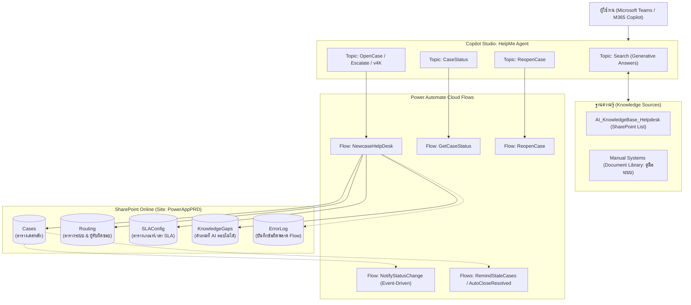

# เอกสารสรุปสถาปัตยกรรมและการทำงานของ HelpMe Agent (Copilot Studio & Power Automate)

เอกสารฉบับนี้จัดทำขึ้นเพื่อสรุปภาพรวมการทำงานของ **HelpMe Agent**, การเชื่อมต่อกับฐานข้อมูล, กลไกของ Workflows ในการตัดสินใจกำหนด **Owner**, **Priority**, **Severity**, และแนวทางการต่อยอดเพื่อพัฒนาระบบ **Knowledge Management** ใหม่สำหรับ Deves Insurance

---

## 1. ภาพรวมระบบและสถาปัตยกรรม (System Overview)

HelpMe Agent ทำหน้าที่เป็นศูนย์กลางระบบ Helpdesk อัจฉริยะ (AI-Powered IT Helpdesk) ทำงานร่วมกัน 3 เลเยอร์หลัก:
1. **Conversation Layer (Microsoft Copilot Studio)**: รับคำถาม, ค้นหาคำตอบจาก Knowledge Base, และรวบรวมข้อมูลเมื่อต้องเปิดเคส
2. **Integration & Business Logic Layer (Power Automate Cloud Flows)**: ประมวลผลตรรกะ, ตัดสินระดับความสำคัญ, คำนวณ SLA, จับคู่ทีมงานผู้รับผิดชอบ, และส่งอีเมลแจ้งเตือน
3. **Data & Persistence Layer (SharePoint Online - Site `PowerAppPRD`)**: จัดเก็บข้อมูลเคส, ฐานข้อมูลการจัดสรรงาน, การตั้งค่า SLA, และฐานความรู้



---

## 2. แหล่งข้อมูลที่ระบบเกี่ยวพัน (Data Ecosystem)

ระบบเชื่อมต่อกับ 6 แหล่งข้อมูลหลักบน SharePoint Online ไซต์ `PowerAppPRD` (`https://dvsins.sharepoint.com/sites/PowerAppPRD`):

| แหล่งข้อมูล | ชนิด | หน้าที่หลัก | คอลัมน์สำคัญ |
|---|---|---|---|
| **`Cases`** | SharePoint List | จัดเก็บประวัติและสถานะเคสทั้งหมด | `CaseID`, `SystemName`, `CaseType`, `Priority`, `Severity`, `ProblemDetail`, `ReporterName`, `ReporterEmail`, `Statuscase`, `AssignedOwner`, `SlaDueDate`, `FirstResponseDueDate`, `StatusNote` |
| **`Routing`** | SharePoint List | ตาราง Master จับคู่ระบบงานกับทีมรับผิดชอบ | `SystemName`, `ToNotifyBA`, `ToNotifySA`, `CCNotify` *(มีแถว `Helpdesk` เป็นค่าตั้งต้นเมื่อไม่พบระบบ)* |
| **`SLAConfig`** | SharePoint List | กำหนดระยะเวลา SLA ตามระดับความรุนแรง | `Severity`, `FirstResponseHours`, `ResolutionHours`, `EscalateToCC` |
| **`KnowledgeGaps`** | SharePoint List | รวบรวมคำถามที่ผู้ใช้ถามแต่ AI ตอบไม่ได้ | `Title`, `UserQuestion`, `SystemGuess`, `RelatedCaseID`, `GapStatus` |
| **`ErrorLog`** | SharePoint List | บันทึกประวัติกรณี Flow ทำงานผิดพลาด | `FlowName`, `ErrorCode`, `ErrorMessage`, `ContextData`, `Timestamp` |
| **`Knowledge Base`** | List & Library | แหล่งข้อมูลอ้างอิงสำหรับ AI ใช้ตอบคำถาม | 1) `AI_KnowledgeBase_Helpdesk` (List Q&A)<br>2) `Manual Systems` (Library คู่มือระบบ) |

---

## 3. การทำงานของ Copilot Studio Topics

| Topic | ตัวกระตุ้น (Trigger Pattern) | กลไกการทำงาน |
|---|---|---|
| **`Search`** | Intent อื่นๆ ที่ไม่ตรงเงื่อนไข (OnUnknownIntent) | 1. ตรวจสอบคีย์เวิร์ดติดตามเคสหรือ Reopen หากพบจะส่งต่อ Topic อื่น<br>2. ค้นหาคำตอบจาก Knowledge Base ผ่าน `SearchAndSummarizeContent`<br>3. หากมีคำตอบ จะสรุปตอบผู้ใช้ทันที |
| **`OpenCase` / `Escalate` / `v4K`** | "แจ้งปัญหา", "เปิดเคส", "ส่งเรื่องต่อ", เมนูหลัก | 1. ซักถามข้อมูลผู้แจ้ง (ชื่อ, เบอร์, อีเมล, ระบบ, รายละเอียดปัญหา)<br>2. ส่งค่าพารามิเตอร์เข้า Flow `NewcaseHelpDesk`<br>3. แจ้งหมายเลข `CaseID` ให้ผู้ใช้ทราบ |
| **`CaseStatus`** | "ติดตามเคส", "สถานะเคส", "HD-xxxx" | ดึงอีเมลผู้ใช้จาก Context หรือรับหมายเลขเคส -> เรียก Flow `GetCaseStatus` -> ค้นหาในตาราง `Cases` -> ตอบสรุปสถานะ |
| **`ReopenCase`** | "เปิดเคสเดิมใหม่", "ยังไม่หาย", "reopen" | รับหมายเลขเคส -> ตรวจสอบว่าเป็นเคสที่ปิดแล้วหรือไม่ -> เรียก Flow `ReopenCase` ปรับสถานะเคสกลับเป็น `Reopened` |

---

## 4. กลไกการทำงานของ Workflows (เจาะลึก Flow: `NewcaseHelpDesk`)

เมื่อ Agent ส่งข้อมูลปัญหาเข้ามา Flow **`NewcaseHelpDesk`** จะดำเนินการตามลำดับขั้นตอนดังนี้:

### 4.1 การจำแนกประเภทเคส (`CaseType`)
Flow ตรวจสอบประเภทการแจ้งจากค่าคำสั่งเริ่มต้น:
- มีคำว่า "ปลดล็อค" -> `CaseType = "Access"`
- มีคำว่า "สอบถาม" -> `CaseType = "Service Request"`
- อื่นๆ -> `CaseType = "Incident"`

### 4.2 การคำนวณความเร่งด่วน (`Priority`) และระดับความรุนแรง (`Severity`)
- **การกำหนด `Priority`**:
  - ตรวจสอบข้อความในรายละเอียดปัญหา (`ProblemDetail`):
    ```json
    @if(contains(triggerBody()?['text_5'], 'ด่วน'), 'ด่วน', 'ปกติ')
    ```
  - หากมีคำว่า "ด่วน" จะได้ค่า **`ด่วน`** หากไม่มีจะได้ค่า **`ปกติ`**
- **การกำหนด `Severity`**:
  - ตรวจสอบจากค่าข้อความเดียวกัน:
    ```json
    @if(contains(triggerBody()?['text_5'], 'ด่วน'), 'P2', 'P3')
    ```
  - เคสด่วนจะถูกจัดระดับเป็น **`P2`**, เคสปกติจะถูกจัดระดับเป็น **`P3`**
  - *(ระดับ `P1` สงวนไว้สำหรับการระบุโดย Admin เมื่อระบบหลักล่มทั้งองค์กร)*

### 4.3 การคำนวณเวลา SLA (`SlaDueDate` และ `FirstResponseDueDate`)
Flow นำค่า `Severity` ที่ได้ไป Query ตาราง `SLAConfig`:
- **ระดับ P2**:
  - `FirstResponseHours` = 4 ชม. -> `FirstResponseDueDate = addHours(utcNow(), 4)`
  - `ResolutionHours` = 24 ชม. -> `SlaDueDate = addHours(utcNow(), 24)`
- **ระดับ P3**:
  - `FirstResponseHours` = 8 ชม. -> `FirstResponseDueDate = addHours(utcNow(), 8)`
  - `ResolutionHours` = 48 ชม. -> `SlaDueDate = addHours(utcNow(), 48)`

### 4.4 การจัดสรรผู้รับผิดชอบ (`AssignedOwner`) และ Email Routing
Flow ค้นหาผู้รับผิดชอบจากตาราง **`Routing`**:
1. **ค้นหาตามชื่อระบบงาน**:
   ```odata
   $filter = "SystemName eq '@{triggerBody()?['text_4']}'"
   ```
2. **กรณีพบระบบงานในตาราง**:
   - ผู้รับผิดชอบหลัก (`MailTo`): รวมอีเมลจาก `ToNotifyBA` และ `ToNotifySA`
   - ผู้รับผิดชอบร่วม (`MailCC`): ดึงจาก `CCNotify`
3. **กรณีไม่พบระบบงาน (Fallback Mechanism)**:
   - หากผู้ใช้ระบุชื่อระบบที่ไม่ตรง หรือเลือก "อื่นๆ" Flow จะค้นหาแถว **`SystemName eq 'Helpdesk'`** อัตโนมัติ เพื่อส่งมอบงานให้ทีม Helpdesk กลาง
4. **การบันทึกและส่งแจ้งเตือน**:
   - บันทึกอีเมลทีมงานลงคอลัมน์ **`AssignedOwner`** ในตาราง `Cases`
   - ส่งอีเมลแจ้งเตือนทีมผู้รับผิดชอบ (`Send_email_team`)
   - ส่งอีเมลตอบรับผู้แจ้งปัญหา (`Send_email_ack_reporter`) พร้อมแจ้งหมายเลข `CaseID`

### 4.5 การบันทึกช่องว่างความรู้ (`KnowledgeGaps`)
หากเคสที่เปิดไม่ใช่ประเภท `Access` Flow จะนำหัวข้อและคำถามไปบันทึกลงตาราง `KnowledgeGaps` อัตโนมัติ โดยตั้งสถานะเป็น `New` เพื่อเป็นโจทย์ให้ทีม Knowledge Management นำไปจัดทำคู่มือหรือคำตอบในอนาคต

---

## 5. ตระกูล Flows สนับสนุนอื่นๆ (Background Automation)

| Flow | ตัวกระตุ้น (Trigger) | หน้าที่ |
|---|---|---|
| **`NotifyStatusChange`** | เมื่อเคสในตาราง `Cases` มีการแก้ไข | ตรวจสอบว่า `Statuscase` มีการเปลี่ยนค่าหรือไม่ หากเปลี่ยนจะส่งอีเมลแจ้งผู้แจ้งทันที พร้อมอัปเดต `LastNotifiedStatus` |
| **`RemindStaleCases`** | ทำงานทุกวันจันทร์ - ศุกร์ เวลา 09:00 น. | ตรวจสอบเคสที่เกินกำหนด `FirstResponseDueDate` หรือ `SlaDueDate` แล้วส่งอีเมลแจ้งเตือน `AssignedOwner` และ CC ผู้บังคับบัญชา |
| **`AutoCloseResolved`** | ทำงานทุกวันจันทร์ - ศุกร์ เวลา 08:30 น. | ตรวจสอบเคสที่มีสถานะ `Resolved` เกิน 3 วันโดยไม่มีการตอบกลับ แล้วปรับสถานะเป็น `Closed` อัตโนมัติ |

---

## 6. ข้อเสนอแนะเชิงสถาปัตยกรรมสำหรับ "ระบบจัดการ Knowledge ใหม่"

เพื่อให้ระบบ Knowledge Management ที่จะสร้างขึ้นใหม่ ทำงานผสานกับ AI Agent ได้อย่างแม่นยำและรวดเร็ว ขอแนะนำแนวทางออกแบบดังนี้:

### 6.1 เปลี่ยนโครงสร้างจากเอกสารไฟล์เป็น Structured Knowledge Articles
- **จุดอ่อนของ Document Library เดิม**: การเก็บเป็นไฟล์ PDF/Word ขนาดใหญ่ ทำให้ Agent ค้นหาช้า ดึงข้อมูลกระจัดกระจาย และสรุปผิดพลาดได้ง่าย
- **โครงสร้างตาราง Knowledge Base ที่แนะนำ (SharePoint List หรือ Dataverse Table)**:
  - `KB_ID` (เช่น KB-MOTOR-001)
  - `Title` / `Question` (คำถามหรือหัวเรื่องปัญหา)
  - `SystemName` (เชื่อมโยงกับรายชื่อระบบในตาราง `Routing`)
  - `Category` (เช่น การตั้งค่าสิทธิ์, แก้ไขข้อมูล, ปัญหาโปรแกรม)
  - `Answer_Summary` (คำตอบสรุปแบบสั้น สำหรับ Generative AI นำไปตอบใน 2-3 บรรทัด)
  - `Solution_Steps` (ขั้นตอนแก้ไขปัญหาแบบ 1-2-3 ชัดเจน)
  - `Keywords` (คำค้นหาทางเลือกที่พนักงานมักพิมพ์)
  - `Status` (Draft / Pending Review / Approved / Archived) — *กำหนดให้ AI ค้นหาเฉพาะสถานะ `Approved` เท่านั้น*

### 6.2 เชื่อมโยง Knowledge Pipeline เข้ากับวงจรเคส
1. **Feedback Loop จาก `KnowledgeGaps`**:
   - นำตาราง `KnowledgeGaps` มาแสดงผลในหน้าจอ Knowledge Manager เพื่อให้ทีมงานเห็นทันทีว่าคำถามใดที่ผู้ใช้ถามบ่อยแต่ AI ยังไม่มีคำตอบ
2. **Case-to-Knowledge Promotion จาก `Monitor_case_Helpdesk`**:
   - เคสที่ปิดงานสำเร็จในแอป `Monitor_case_Helpdesk` มีการบันทึก **หมวดหมู่วิธีแก้ปัญหา (`ResolutionCategory`)** และ **สรุปแนวทางแก้ไขปัญหา (`ResolutionSummary`)** ไว้อย่างชัดเจน
   - สามารถสร้างฟังก์ชันปุ่ม **"แปลงเป็นบทความ KB (Promote to KB)"** เพื่อนำแนวทางแก้ไขที่ผ่านการตรวจสอบแล้ว ไปสร้างเป็นร่างบทความ (Draft) ในระบบ Knowledge ใหม่ได้ทันทีโดยไม่ต้องพิมพ์ซ้ำ
