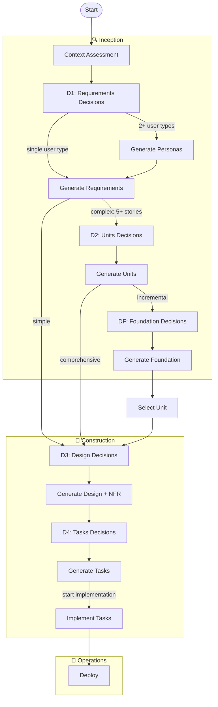

# AI-DLC Spec Workflow — Skill-Based Architecture

A decision-driven software specification workflow powered by persona-based phases. Each phase is executed directly by adopting a specialist persona (Business Analyst, Product Owner, Solution Architect, Software Architect, Tech Lead, Software Engineer) with instructions loaded from reference files.

**Version**: 6.2.0

**Supported Platforms**: Kiro IDE, Claude Code, and other AI assistants

## Quick Start

```
Use the aidlc skill to create a spec for [feature description]
```

The workflow detects your language and communicates in it throughout. Technical content (code, paths, identifiers) stays universal.

## How It Works

The skill makes you (the AI assistant) the orchestrator. For each phase you:
1. Read phase instructions from the skill's `references/phase-prompts/` folder
2. Adopt the specialist persona described in those instructions
3. Execute the phase logic directly, generating artifacts
4. Present results to the user
5. Wait for approval
6. Update workflow state and audit trail
7. Route to the next phase

At each phase, the user makes explicit decisions through decision gates:
- **D1 Requirements Decisions**: Feature scope, user types, core functionality
- **D2 Units Decisions**: Decomposition strategy, architecture pattern
- **D3 Design Decisions**: Technology stack, frontend hosting, IaC, testing, NFRs
- **D4 Tasks Decisions**: Implementation approach, task breakdown, testing strategy

Simple features (≤4 stories) skip Phase 3. Simple designs (≤10 stories) get a single `design.md` instead of a modular folder.

## Workflow Overview



## Phases & Personas

| Phase | Persona | Gate | Responsibility |
|-------|---------|------|---------------|
| 1. Context | Business Analyst | — | Scans workspace, assesses impact, generates context.md and steering files |
| 2. Requirements | Product Owner | D1 | Requirements decisions, personas, user stories with EARS criteria |
| 3. Units | Solution Architect | D2, DF | Units decisions, system decomposition, foundation (incremental mode) |
| 4. Design | Software Architect | D3 | Design decisions, components, data model, APIs, NFR |
| 5. Tasks | Tech Lead | D4 | Tasks decisions, task breakdown, implementation plan |
| 6. Implementation | Software Engineer | — | Code, tests, coverage tracking, merge resolution |
| Validation | Decision Validator | — | Validates D1-D4/DF decisions for conflicts |
| Review | Architecture Reviewer | — | Reviews designs across workstreams for conflicts |

## Installation

The skill auto-detects your environment and adapts automatically.

### Kiro IDE / CLI

```bash
cp -r skills/aidlc/ /path/to/project/.kiro/skills/aidlc/
```

### Claude Code

```bash
cp -r skills/aidlc/ /path/to/project/.claude/skills/aidlc/
```

### Other AI Assistants (Cursor, Windsurf, etc.)

```bash
cp -r skills/aidlc/ /path/to/project/.ai/skills/aidlc/
```

The skill will detect the platform based on directory structure and adapt tool usage accordingly.

## Usage

Activate the skill in chat:
```
Use the aidlc skill to create a spec for [feature]
```

### Resume an Existing Spec
```
Continue my [feature] spec
```

### Command Mode (Optional)

Instead of following the guided flow, jump directly to any phase:

| Command | Description |
|---------|------------|
| `start` | Initialize new feature |
| `resume` | Resume existing workflow |
| `status` | Show current progress |
| `next` | Execute whatever comes next |
| `context` | Run context assessment |
| `requirements` | Full requirements phase (D1 → validate → generate) |
| `units` | Full decomposition phase (D2 → validate → generate) |
| `foundation` | Full foundation phase (DF → validate → generate) |
| `design` | Full design phase (D3 → validate → generate) |
| `tasks` | Full tasks phase (D4 → validate → generate) |
| `implement` | Start/resume implementation |

Commands are state-aware — they check what already exists and pick up from the right sub-step. The guided flow remains the default.

## Steering Files

Phase 1 generates persistent project context files at `.kiro/steering/`:
- `product.md` — product overview, target users, key features
- `tech.md` — technology stack, architecture, conventions
- `structure.md` — repository layout, key directories, entry points
- `aidlc-workflow.md` — workflow instructions and implementation context

These are progressively enriched as phases complete.

## Generated Artifacts

**Spec artifacts** (`.kiro/specs/{feature}/`):
- `context.md`, `personas.md`, `requirements.md`, `units.md`, `foundation.md`
- `design.md` + optional `design/` folder
- `tasks.md`

**Workflow state** (`.aidlc/workflow/{feature}/`):
- `decisions-*.md`, `audit.md`, `workflow-state.json`

In incremental mode, each unit gets its own folders:
- Specs: `.kiro/specs/{feature}-{unit}/`
- Workflow: `.aidlc/workflow/{feature}-{unit}/`

## Project Structure

```
├── skills/
│   └── aidlc/
│       ├── SKILL.md                      # Entry point — orchestrator logic
│       ├── assets/                       # Output templates (21 files)
│       └── references/
│           ├── phase-prompts/            # Phase instruction files (8 files)
│           ├── guides/                   # Reference guides (12 files)
│           └── shared/                   # Workflow rules, state, validation, dispatcher (12 files)
└── README.md
```

## Workflow Variations

**Simple** (≤4 stories, single domain):
```
Context → D1 → Requirements → D3 → Design → D4 → Tasks → [Implementation]
```

**Complex** (5+ stories, multiple domains):
```
Context → D1 → Personas → Requirements → D2 → Units → D3 → Design + NFR → D4 → Tasks → [Implementation]
```

**Incremental** (per unit, after units defined):
```
→ DF → Foundation → for EACH unit: D3 → Design → D4 → Tasks → [Implementation] → next unit
```

## Key Features

- **Cross-platform support** — Works with Kiro IDE, Claude Code, and other AI assistants with automatic adaptation
- **Skill-based architecture** — Single entry point, no agent configs needed
- **Persona-driven phases** — Each phase adopts a specialist persona for domain-appropriate output
- **Decision-driven** — You make the choices through decision gates, phases generate from your decisions
- **Command mode** — Jump directly to any phase via commands (`context`, `requirements`, `design`, etc.) with state-aware resumption
- **Adaptive complexity** — Simple features get lightweight output, complex systems get full modular specs
- **Incremental mode** — Large systems decompose into units, each designed and implemented independently
- **Parallel implementation** — Tasks grouped into dependency waves; independent tasks execute via parallel sub-agents
- **Context-efficient** — Each phase loads only the instructions and templates it needs
- **Multi-language support** — Detects your language, generates everything in it
- **Resume across sessions** — Pick up where you left off via workflow state
- **Complete traceability** — Every artifact references its source decisions

## Platform Compatibility

| Platform | Core Workflow | Parallel Mode | Context Persistence | Status |
|----------|---------------|---------------|---------------------|--------|
| Kiro IDE | ✅ Full | ✅ Full | ✅ Auto-inject | Fully Supported |
| Kiro CLI | ✅ Full | ✅ Full | ✅ Auto-inject | Fully Supported |
| Claude Code | ✅ Full | ✅ Yes¹ | ✅ CLAUDE.md | Fully Supported |
| Cursor | ✅ Full | 🟡 Standard² | 🟡 Manual | Basic Support |
| Windsurf | ✅ Full | 🟡 Standard² | 🟡 Manual | Basic Support |
| Other | ✅ Full | 🟡 Standard² | 🟡 Manual | Basic Support |

¹ Parallel mode on Claude Code may execute tasks sequentially internally but still provides benefits
² Standard (sequential) implementation mode recommended for these platforms

See [Cross-Platform Compatibility Guide](skills/aidlc/references/guides/cross-platform-compatibility.md) for detailed information.

## Credits

- [AI-DLC Methodology](https://github.com/awslabs/aidlc-workflows)
- [EARS Notation](https://www.iaria.org/conferences2015/filesICCGI15/ICCGI_2015_Tutorial_EARS.pdf)

## License

MIT
